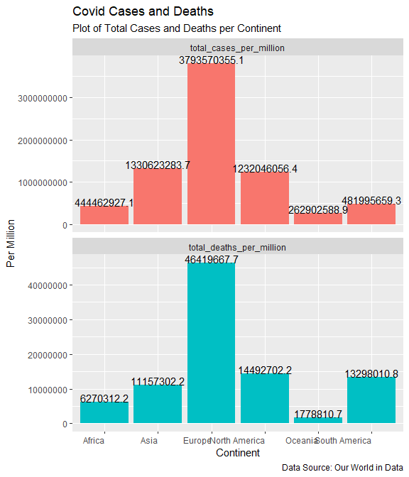
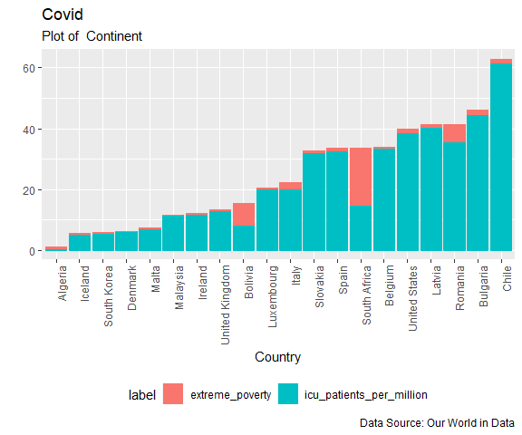
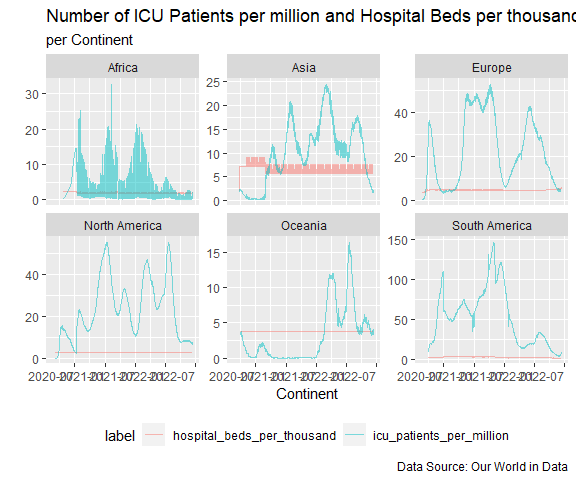
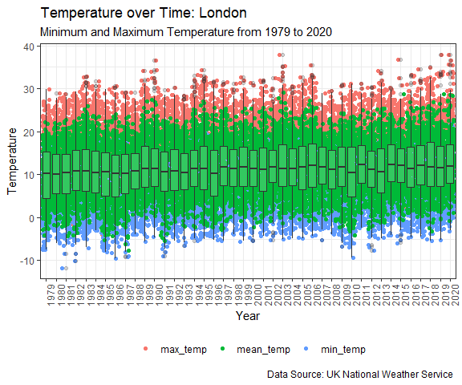
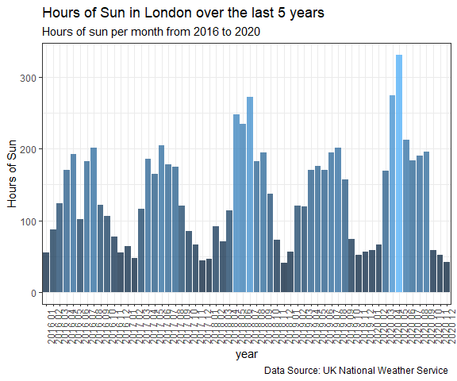
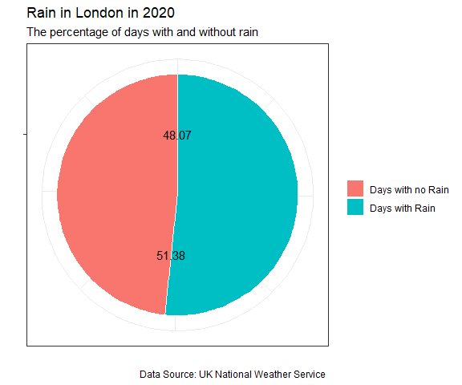
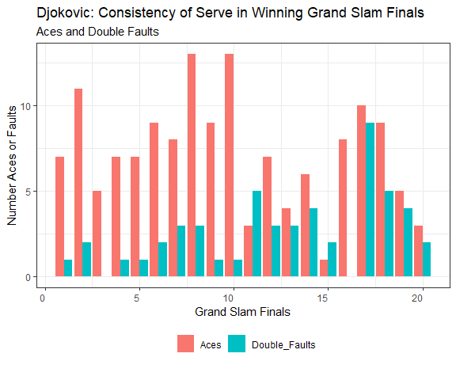
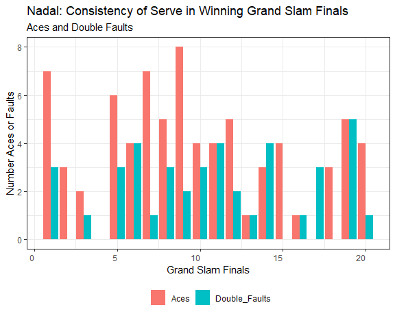
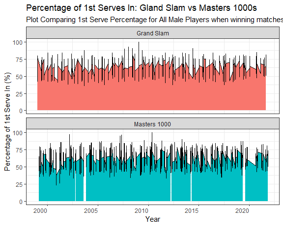
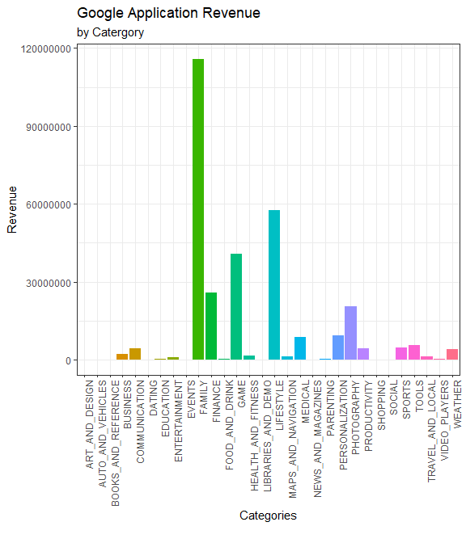

# Purpose

Purpose of this markdown to display the results of the practical.

# Question 1

See if you can provide some insights using the dataset into how African
countries’ experience differed from other regions.

Provide some insights into whether countries with specific concentrated
groupings (e.g. more poverty, higher prevalence of smokers, higher
general life expectancy and elderly populations) displayed distinct
patterns in the severity of their Covid experience.

Show how quickly different regions increased their hospitalization
facilities, and whether this led or lagged ICU admissions.

Question 2: Reasons not to go to London

## Low Average Temperature

London experiences lower average temperatures than South Africa. From
the graph below, the average temperature in London has consistently
fluctuates around 10 °C for over four decades.

## Few Hours of Sunlight per Month

London experiences very few hours of sunlight per month. In the last
five years, the month with most number of hours of sunlight was May
2020, with approximately 330 hours in that month. On average, that is
less than two hours of sunlight per day.

## It rains more than half the time

Consider the pie chart below, in 2020 it rained more than half the days
in that year. In London there were at least 186 of rain, comparatively,
Cape Town received 111 days of rain.

# Question 3: Interesting Tennis Statistics

Nadal vs Djokovic: Aces and Doubles Faults in Grand Slam Finals.

Both Rafael Nadal and Novak Djokovic have won at least 20 Grand Slams.
The two graphs below shed some light on the there consistency in on the
biggest stage. Both players have performed incredible well over the past
years, but in Grand Slam Finals matches fine margins determine champions
given the 5 set structure and the strength of opponent that reaches a
final. Both players have recorded very few double faults in their finals
wins, which is remarkable given the stage, pressure, and duration. And
on average will serve more aces than doubles faults in the match.
Djokovic even more impressively, has need serve more double faults than
aces in any of this finals wins.

1ST Serve Percentage: Gland Slam vs Masters 1000s

The graph below sets out to answer the question, do winning male tennis
players have a better or worse 1st serve in percentage on a bigger
stage, i.e. a Grand Slam, and has this been the case over time. From the
graph, the difference between 1st serve in percentage during a Grand
Slam (best of 5 sets) or Masters 1000 (best of 3 sets) tournament,
appears to reasonably even. However, there does seem to be a slight
improvement for both tournaments over time. Lets investigate this
further.

From the table of reported statistics of the past 25 years one can see
that 1st serve in percentage of male tennis players has increase
steadily over the years. In addition to 1st serve in percentage, other
averages are reported here. Most notably, the average height of winning
male tennis players has been increasing over the past 25 years, as if to
suggest that taller players win more often. However, it is far more
likely that this is a result of more taller male players making it onto
the pro circuit than before.

| Date | 1st Serve In (%) | 1st Serve Won (%) | Aces | Double Faults | Height |
|:-----|-----------------:|------------------:|-----:|--------------:|-------:|
| 1997 |            59.66 |             46.53 | 7.95 |          2.67 | 184.38 |
| 1998 |            58.53 |             44.94 | 7.65 |          2.71 | 185.38 |
| 1999 |            59.01 |             46.79 | 8.00 |          3.23 | 186.95 |
| 2000 |            55.74 |             43.34 | 8.78 |          3.44 | 187.38 |
| 2001 |            59.98 |             45.67 | 9.93 |          3.44 | 183.42 |
| 2002 |            55.60 |             42.74 | 9.48 |          3.90 | 184.60 |
| 2003 |            60.43 |             45.23 | 8.13 |          3.09 | 183.29 |
| 2004 |            61.33 |             47.21 | 8.12 |          3.06 | 184.14 |
| 2005 |            62.13 |             46.52 | 7.94 |          2.41 | 184.06 |
| 2006 |            64.45 |             47.74 | 7.19 |          2.09 | 184.26 |
| 2007 |            64.62 |             48.48 | 6.88 |          2.10 | 184.00 |
| 2008 |            66.09 |             50.32 | 6.63 |          1.83 | 185.71 |
| 2009 |            63.39 |             48.68 | 8.11 |          2.47 | 187.55 |
| 2010 |            62.53 |             47.80 | 9.64 |          3.09 | 187.84 |
| 2011 |            63.56 |             48.69 | 7.29 |          2.21 | 187.59 |
| 2012 |            62.33 |             47.44 | 7.22 |          2.14 | 186.97 |
| 2013 |            63.48 |             48.42 | 6.72 |          1.88 | 186.49 |
| 2014 |            63.25 |             48.99 | 8.84 |          2.57 | 187.95 |
| 2015 |            62.56 |             48.86 | 7.33 |          2.33 | 188.39 |
| 2016 |            62.14 |             47.70 | 7.13 |          3.14 | 188.14 |
| 2017 |            64.33 |             48.77 | 8.49 |          2.76 | 187.94 |
| 2018 |            64.93 |             50.60 | 8.70 |          2.77 | 191.21 |
| 2019 |            63.73 |             49.80 | 6.27 |          2.03 | 187.12 |
| 2020 |            63.83 |             49.59 | 9.16 |          3.16 | 188.58 |
| 2021 |            63.25 |             48.39 | 8.98 |          3.17 | 191.58 |

Descriptive Statistics of Tennis Match Winners over the last 25 Years

# Question 5

Application Categories that generate the most Revenue.

From the graph below, one can see that the three categories of
applications with the largest revenues on the Google Store are
Lifestyle, Finance and Photography. This is likely due to the fact that
these applications would appeal to the most users. I would issue
caution, when considering developing a new app in any of these three
categories as there is a large amount of competition and a new app may
struggle to gain traction with incumbent apps having the first mover
advantage.

The table below, displays the mean statistics of price, number of
installs, revenue, size per category. In terms of average price, the
three most expensive categories are Finance, Lifestyle and Events.

    ## Error in df_q5.2_data(.): could not find function "df_q5.2_data"

| Date | 1st Serve In (%) | 1st Serve Won (%) | Aces | Double Faults | Height |
|:-----|-----------------:|------------------:|-----:|--------------:|-------:|
| 1997 |            59.66 |             46.53 | 7.95 |          2.67 | 184.38 |
| 1998 |            58.53 |             44.94 | 7.65 |          2.71 | 185.38 |
| 1999 |            59.01 |             46.79 | 8.00 |          3.23 | 186.95 |
| 2000 |            55.74 |             43.34 | 8.78 |          3.44 | 187.38 |
| 2001 |            59.98 |             45.67 | 9.93 |          3.44 | 183.42 |
| 2002 |            55.60 |             42.74 | 9.48 |          3.90 | 184.60 |
| 2003 |            60.43 |             45.23 | 8.13 |          3.09 | 183.29 |
| 2004 |            61.33 |             47.21 | 8.12 |          3.06 | 184.14 |
| 2005 |            62.13 |             46.52 | 7.94 |          2.41 | 184.06 |
| 2006 |            64.45 |             47.74 | 7.19 |          2.09 | 184.26 |
| 2007 |            64.62 |             48.48 | 6.88 |          2.10 | 184.00 |
| 2008 |            66.09 |             50.32 | 6.63 |          1.83 | 185.71 |
| 2009 |            63.39 |             48.68 | 8.11 |          2.47 | 187.55 |
| 2010 |            62.53 |             47.80 | 9.64 |          3.09 | 187.84 |
| 2011 |            63.56 |             48.69 | 7.29 |          2.21 | 187.59 |
| 2012 |            62.33 |             47.44 | 7.22 |          2.14 | 186.97 |
| 2013 |            63.48 |             48.42 | 6.72 |          1.88 | 186.49 |
| 2014 |            63.25 |             48.99 | 8.84 |          2.57 | 187.95 |
| 2015 |            62.56 |             48.86 | 7.33 |          2.33 | 188.39 |
| 2016 |            62.14 |             47.70 | 7.13 |          3.14 | 188.14 |
| 2017 |            64.33 |             48.77 | 8.49 |          2.76 | 187.94 |
| 2018 |            64.93 |             50.60 | 8.70 |          2.77 | 191.21 |
| 2019 |            63.73 |             49.80 | 6.27 |          2.03 | 187.12 |
| 2020 |            63.83 |             49.59 | 9.16 |          3.16 | 188.58 |
| 2021 |            63.25 |             48.39 | 8.98 |          3.17 | 191.58 |

Descriptive Statistics of Tennis Match Winners over the last 25 Years
